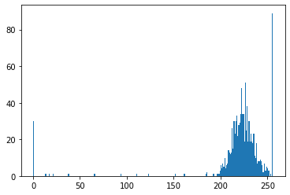
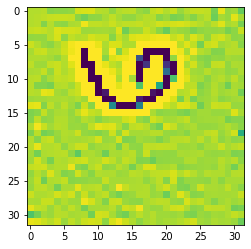

<center>
<ins>

# **Hadoop Cluster in Machine Learning**
</ins>
<br>
<ins>

## _Developed By_
</ins>

## **MAYURAKSHA SIKDAR**

<br>
<ins>

## _Contributors:_
</ins>

###  - **SAPTARSHI GHOSH**

### - **SWAPNIL SARKAR**

### - **ANUSHKA GHOSH**

<br>
<ins>

## _Under the Supervision of_
</ins>

### **MRS. ANANYA BANERJEE**

**Assistant Professor, Department of Computer Science & Engineering,
Narula Institute of Technology, Kolkata, India.**

### **MR. SOMEN MONDAL**

**Assistant Professor, Department of Computer Science & Engineering,
Coochbehar Government Engineering College
, Kolkata, India.**

## **_Date: 21<sup>st</sup> April, 2020_**
</center>

<br><br><br><br><br><br><br><br><br><br><br><br>
<center>

---
## **CONTENTS**
---
</center>

I.  Abstract

II. Introduction

III. Motivation

IV. Survey

V.  Broad Observations

VI. Objectives

VII. Working Procedures/Approaches/Implementation

1.  Working Procedure

2.  Approach for Machine Learning

3.  Approach for Distributed System

4.  Implementation

VIII. Result Evaluation/Discussion

1.  Result

2.  Challenges

IX. Scope for future work

X.  Conclusion

XI. References


<div style="text-align: justify">
<br><br><br><br>
<center>

---
## I.  **ABSTRACT**
---
</center>

This research deals with distribution of data, across a distributed
system architecture, and creation of a machine learning model for
benchmarking Bengali Handwritten Numeric Text.

It is often seen that a machine learning model or cluster working on a
single machine takes up considerable amount of resource and time when
the amount of data is significantly high. A distributed system overcomes
these shortcomings and enhances speed of processing, using horizontal
scaling instead of vertical scaling. This distribution is achieved using
Hadoop Cluster here.


<br><br><br><br>
<center>

---
## II. **INTRODUCTION**
---

</center>
<br><br>
<div style="text-align: justify">

**Machine learning** (**ML**) has become a primary mechanism for distilling structured, semi-structured or unstructured information and knowledge from raw data, turning them into automatic predictions and actionable hypotheses for diverse applications, such as: analyzing social networks; reasoning about customer behavior; interpreting texts, images, and videos; identifying disease and treatment paths; driving vehicles without the need for a human; and tracking anomalous activity
for cybersecurity, among others.
<br><br>

**Artificial Neural Networks** (**ANN**) or **connectionist systems** are computing systems that are inspired by, but not identical to, biological neural networks that constitute animal brains. Such systems \"learn\" to perform tasks by considering examples, generally without being programmed with task-specific rules. An ANN is based on a collection of connected units or nodes called artificial neurons, which loosely model the neurons in a biological brain.
<br><br>

**Convolutional Neural Network** (CNN, or ConvNet) in deep learning, is a subset of Artificial Neural Network, most commonly applied to analyzing visual imagery. They are also known as shift invariant or space invariant artificial neural networks (SIANN), based on their shared-weights architecture and translation invariance characteristics. They have applications in image and video recognition, recommender systems, image classification, medical image analysis, and natural language processing.
<br><br>

**Unstructured data** (or **unstructured information**) is information that either does not have a pre-defined data model or is not organized in a pre-defined manner. Unstructured information is typically text-heavy, but may contain data such as dates, numbers, and facts as well. This results in irregularities and ambiguities that make it difficult to understand using traditional programs as compared to data stored in fielded form in databases or annotated (semantically tagged) in documents.
</div>

<br><br><br><br>
<center>

---
## III. **MOTIVATION**
---
</center>
Machine Learning has become an integral part of any futuristic project
work and thus a subject of interest for undergraduates. The increasing
number of projects has given rise to another problem -- the allocation
of resources and processing power of a system. However, to conduct a
research of considerable significance, many people don't have access to
a powerful system. But it is relatively easier to get access to a number
of less powerful machines. This is the motivation of our work. Hadoop
Cluster provides a pragmatic solution to the distributed system
architecture problems.

<br><br><br><br>
<center>

---
## IV. **SURVEY**
---
</center>
<div style="text-aling: justify">
Today, the amount of data is exploding at an unprecedented rate as a result of developments in Web technologies, social media, and mobile and sensing devices [29]. Traditional approaches struggle when faced with these massive data. More than 80% of all potentially useful business information is unstructured data, in kind of sensor readings, console logs and so on. The large number and complexity of unstructured data opens up many new possibilities for the analyst. Big data Analytics [26] plays an important role in making sense of the data and exploiting its value. Text mining and natural language processing are two techniques with their methods for knowledge discovery from textual context in documents. An approach to organize complex unstructured data and to retrieve necessary information in an efficient way has already been tested. Unstructured data [27] is heterogeneous and variable in nature and comes in many formats, including text, document, image, video and more. Unstructured data is growing faster than structured data. As a new, relatively untapped source of insight, unstructured data analytics can reveal important interrelationships that were previously difficult or impossible to determine. New technologies are emerging to make unstructured data analytics possible and cost-efficient. The new approach redefines the way data is managed and analyzed by leveraging the power of a distributed grid of computing resources. It utilizes easily scalable "shared nothing" architecture [28], distributed processing frameworks, and non-relational and parallel relational
databases.
<br>
<br>
The correct use of model evaluation, model selection, and algorithm selection techniques are vital in academic machine learning research. Traditionally, Machine Learning models has been trained and tested through data stored in structured format in databases and excel files (.csv). But due to the huge amount of data generation and requirement of real-time analysis, the data source from a single machine is creating a bottleneck of data input to the model.
<br>
<br>

This project aims to address this situation, with a concept of data distribution across machines, so, that the data feed to the model is improved and bottleneck can be reduced.
</div>
<br><br><br><br>
<center>

---
## V.  **BROAD OBSERVATIONS**
---
</center>

It is seen that as data quantity is increasing, machine learning model computation is becoming a heavy task for the system. Also, the possibility of data corruption, system failure, link break, among others are increasing the counter productivity of the system.

Huge data feed to the model from data storage, like, relational database, excel file (.csv), is also a traditional way, which acts as a bottleneck in a system.

<br><br><br><br>
<center>

---
## VI. **OBJECTIVES**
---
</center>

-   To create an optical character recognition (OCR) for Bengali
    handwritten numeric text.
<br>
-   Security Feature: Fault tolerant feature where data is processed in     one node and data is replicated in another note in the cluster. So, when a failure occurs in the one node or data is corrupted, copy of data is available in another node.
<br>

-   Autonomy: Because of sharing data by means of data distribution each site is able to retain a degree of control over data that are stored locally.
<br>

-   In distributed system there is a global database administrator responsible for the entire system. A part of global data base administrator responsibilities is delegated to local data base administrator for each site. Depending upon the design of distributed database each local database administrator may have different degree of local autonomy.
<br>

-   Availability: If one site fails in a distributed system, the
    remaining sites may be able to continue operating. Thus, a failure of a site doesn\'t necessarily imply the shutdown of the System.
<br>

-   Real-time analysis: Distributed structure can process small data sets to petabytes of data in real-time.


<br><br><br><br>
<center>

---
## VII. **WORKING PROCEDURES / APPROACH / IMPLEMENTATION**
---
</center>
<br><br>

### 7.1 **WORKING PROCEDURE**
<br>
This project is based on the concept of applying Machine Learning to data stored across distributed systems. For Machine Learning analysis, a model for unstructured data (images) classification is made with Convolution Neural Network (CNN) approach, with Google's TensorFlow framework and Keras library (neural network library). For the purpose of storing huge amounts of unstructured data (images) in a distributed computing environment, a special type of computational cluster is designed, that, we call as Hadoop Clusters. A Hadoop cluster is a collection of independent components connected through a dedicated network to work as a single centralized data processing resource. The Hadoop Distributed File System (HDFS) is based on the Google File System (GFS) and provides a distributed file system that is designed to run on commodity hardware.
<br><br><br>

### 7.2 **APPROACH FOR MACHINE LEARNING**
<br>
Machine Learning includes many topics, one of the key topics is
Natural Language Processing (NLP). A sub-topic in NLP is optical
character recognition (OCR). OCR is a technology that enables us to convert different types of documents, such as scanned paper documents, PDF files or images captured by a digital camera into editable and searchable data. OCR of Bengali numeric text is done in this project.
<br>
NumtaDB, a dataset consisting of more than 85,000 images of
hand-written Bengali digits, is used for training machine learning model for optical handwriting recognition. We are using Google's TensorFlow framework, along with Keras (neural
network library), concept of computer vision and image processing to achieve our goal.
<br><br><br>
### 7.3 **APPROACH FOR DISTRIBUTED SYSTEM**
<br>
Unstructured images data are stored in Hadoop Distributed File System across multiple nodes. This data is accessed by the model for the purpose of training and prediction. Since, Hadoop provides for real time analysis of data (up to Peta-Byte), the computational power for input of data to the model is reduced significantly. Hadoop MapReduce engine [28] plays a key role in the entire project. Also, the notion of data corruption is reduced, as data stored is replicated. Failure of the system is unlikely, as in the event of a node failure another node provide backup.
<br><br>
<center>


##### Fig. Overview of the system [15\]
<br><br><br>
</center>

### 7.4 **IMPLEMENTATION**<br>
<br>
#### 7.4.1 **DATASET DESCRIPTION**
NumtaDB, is a Bengali handwritten digit images dataset classification. Dataset contains 85,000+ Bengali digits which can be used for OCR. The dataset is a combination of six datasets that were gathered from different sources and at different times. The sources are labeled from \'a\' to \'f\'. The training and testing sets have separate subsets depending on the source of the data. All the datasets have been partitioned into training and testing sets so that handwriting from the same subject/contributor is not present in both. Number of images per digit kept approximately equal (see count plot below). Most of the data were collected from students of public universities in Dhaka, Bangladesh. As students at these universities come from all around Bangladesh, it is implicitly made sure that the dataset contains representation from diverse regions of Bangladesh. The dataset also contains data from both children and adults. So, it is supposed to be unbiased in terms of geographic location and age. The training dataset contains 5 subsets, code named a, b, c, d, e; whereas the testing dataset contains 6 subsets, code named a, b, c, d, e, f. Additionally two augmented data sets were produced from test set a and c. [12] [14] [19]
<br>
Link to Dataset: https://www.kaggle.com/c/numta/data
<br>
Description of images is contained in 5 files (CSV). Each file
contains 7 columns which is described below:
<br><br>

<center>

| Sr. No. | Column Name              | Description                                                                 |
| ------- | ------------------------ | --------------------------------------------------------------------------- |
| 1       | Filename                 | The name of the image file in the   database                                |
| 2       | Original   Filename      | The name of the image file when the   image was scanned                     |
| 3       | ScanID                   | The ID of scan                                                              |
| 4       | Digit                    | The actual digit present in the image                                       |
| 5       | Database name   original | The name of the original database from   where it is taken                  |
| 6       | Contributing team        | Name of the team that is responsible for   collection of the sample         |
| 7       | Database name            | The name of the database where the image   is kept. (Also, the folder name) |

</center>
<br><br>

We are only taking into consideration the "filename" of the images and the "digit" for each row. Others, are insignificant in our calculations. Details about each database(folder) for training and testing is provided below:

<br><br>
<center>

| Sr. No | Database / Folder name | File Format | Samples Present |
| ------ | ---------------------- | ----------- | --------------- |
| 1      | Training-a             | PNG         | 19702           |
| 2      | Training-b             | PNG         | 359             |
| 3      | Training-c             | PNG         | 24298           |
| 4      | Training-d             | PNG         | 10908           |
| 5      | Training-e             | PNG         | 16778           |
| 6      | Testing-a              | PNG         | 3489            |
| 7      | Testing-b              | PNG         | 69              |
| 8      | Testing-c              | PNG         | 4381            |
| 9      | Testing-d              | PNG         | 1948            |
| 10     | Testing-e              | PNG         | 2970            |
| 11     | Testing-f              | PNG         | 495             |
|        | **Total Samples**      |             | **85397**       |
</center>

<br>
<br>
<center>

##### Fig. Respective images of each category are depicted in the plot below:


<br>
<br>
<div style="text-align:justify">
The images are processed from a higher resolution to a 32x32px resolution for faster training (8-bit image). The images are represented in a matrix of
dimension 32x32 having values in the range of 0-255. The Histogram
below shows that the values of pixels are concentrated more around the
200-250 range. Data needs to be normalized in the range 0-1 for faster
processing.
</div>
<br>
<br>

##### Fig. Histogram that depicts the values present inside the matrix for a random image:

<br>
<br>

##### Fig. Original Image sample is provided below:


<br><br>

##### Fig. The Machine Learning training model processes the above image as the image below:


<br>
<br>

##### Fig. A few other samples are provided below:

</center>


<br>
<br>

#### **7.4.2 TOOLS & TECHNOLOGY REQUIRED**

-   **PC/Laptop** --- 1 for Name Node and 3 others for Data Node.
<br>

-   **Anaconda** --- Anaconda is a free and open source distribution of the Python and R programming languages for data science and machine learning related applications, that aims to simplify package management and deployment.
<br>

-   **Jupyter Notebook** --- The Jupyter Notebook is an incredibly powerful tool for interactively developing and presenting data science projects. It comes installed with anaconda.
<br>

-   **TensorFlow** --- TensorFlow is an open-source software library for dataflow programming across a range of tasks.
<br>

-   **Keras** --- Keras is an open source neural network library written in Python.
<br>

-   **Hadoop ---** Apache Hadoop is a collection of open-source software utilities that facilitate using a network of many computers to solve problems involving massive amounts of data and computation. It provides a software framework for distributed storage.
<br>

-   **Java ---** Java Run Time Environment (JRE) is needed for Hadoop.
<br>

-   **Python ---** Python3 must be installed (v. 3.5 and above).
<br>

-   **LAN/Router Connection ---** A connection needs to be setup between the individual nodes of the Hadoop cluster. For faster performance wired connection -- LAN & Switch is required. For wireless connection -- a wireless router needs to be setup and configured to allot the same IP addresses to the individual systems each time the system reconnects to the router.
<br>

-   **Other Python Library ---** Python libraries like Matplotlib,  Pandas, NumPy, Open-Source-Computer-Vision (OpenCV) to name a few.

<br><br>

#### **7.4.3 PROCESS WORKFLOW**
<br>
<ins>

##### **Check Requirements:**
</ins>
<br>

Before starting of the execution process, the following requirement must be satisfied:
<br>

-   Linux systems must be setup. All privileges must be granted to User.
<br>

-   Java must be present in the systems and configured.
<br>

-   Secure connection must be established between Name Node and Data Nodes, using SSH (Secure Shell) key
<br>

-   Hadoop must be installed and configured properly
<br>

-   Check is Hadoop Name Node, Data Nodes, Resource Manager is started when appropriate Hadoop command is used
<br>

-   Open Browser (in Master Node system) to check if Name Node is started at URL : http://hadoop-master:50070/ and Resource Manager is started at 
URL : http://hadoop-master:8088/
<br>

-   Install Python3 (v. 3.5 and above). Install all necessary python3 packages for machine learning process using pip3 package manager for python.
<br>
    
-   Install the following packages:
<br>
    
    > `TensorFlow, Keras, NumPy, Glob2, Matplotlib, Pandas, Pickle, Scikit-Learn (Sklearn), CV2`
    
<br>
<br>
<br>

<ins>

##### **Process Workflow:**

</ins>
<br>

-   Name Node, Data Node, Resource Manager are started using appropriate Hadoop command in the Master Node.
<br>

-   Once all the systems are up --- Name Node, Data Nodes, Resource Manager, Secondary Name Node --- continue with the next process.
    The Hadoop cluster information can be viewed in a web browser, for Name Node the web address is http://hadoop-master:50070/ and for Resource Manager the web address is http://hadoop-master:8088/, by default.
<br>

-   Load Image data into Data Nodes using appropriate Hadoop commands.
<br>

-   Start of Machine Learning process.
<br>

-   Images are loaded to machine learning program.
<br>

-   Data pre-processing is done. Normalization is carried out.
<br>

-   Data is split into Training and Testing set. (90% ─ 10%)
<br>

-   Model training is carried out.
<br>

-   Prediction is done on the test data available
<br>

-   Further testing is done on the testing images provided separately.
<br>

-   Output is generated
<br>
<center>
<br><br>

```flow
st=>start: Start
e=>end
op1=>operation: Start Hadoop cluster
io1=>inputoutput: Load Data in Hadoop – HDFS
op2=>operation: Fetch Data from Hadoop Data Nodes into program
op3=>operation: Data Pre-Processing
op4=>operation: Data is split into Training and Testing set (90% ─ 10%)
op5=>operation: Model Training (Convolution Neural Network model)
op6=>operation: Prediction
op7=>operation: Stop Hadoop cluster

st->op1->io1->op2
op2->op3->op4->op5
op5->op6->op7->e
```

##### Fig. Flow Chart of the process workflow

<br><br>
</center>

**7.4.4 MACHINE LEARNING ALGORITHM**
<br>
| STEPS | ALGORITHM                                                                                                                                                                                                                                                                                                                                                                                                                                                                                                                                                                                                                                                                                                                                                    |
| :---: | ------------------------------------------------------------------------------------------------------------------------------------------------------------------------------------------------------------------------------------------------------------------------------------------------------------------------------------------------------------------------------------------------------------------------------------------------------------------------------------------------------------------------------------------------------------------------------------------------------------------------------------------------------------------------------------------------------------------------------------------------------------ |
|   1   | Start   the Hadoop Name Node and the Data Nodes from Master system                                                                                                                                                                                                                                                                                                                                                                                                                                                                                                                                                                                                                                                                                           |
|   2   | Store   the data from local folder to Data Nodes using appropriate command for Hadoop                                                                                                                                                                                                                                                                                                                                                                                                                                                                                                                                                                                                                                                                        |
|   3   | Import   necessary libraries: NumPy, Glob, OS, OpenCV2, Pandas, Matplotlib, Keras,   Scikit-learn, TensorFlow                                                                                                                                                                                                                                                                                                                                                                                                                                                                                                                                                                                                                                                |
|   4   | Get   data stored in slave nodes from name node, into the machine learning program                                                                                                                                                                                                                                                                                                                                                                                                                                                                                                                                                                                                                                                                           |
|   5   | Visualize   the data → using matplotlib library.    Histogram   → used to view the pixel values of image.    Count   Plot → Plot the number of samples of each image   category                                                                                                                                                                                                                                                                                                                                                                                                                                                                                                                                                                              |
|   6   | Using   OpenCV library:    a)      Turn the images into Grey Scale    b)      Add Gaussian Blur to the image    c)      Add weight of 0.5    d)      Reshape the images that are in larger   size to (32px X 32 px) for faster training                                                                                                                                                                                                                                                                                                                                                                                                                                                                                                                      |
|   7   | Using   NumPy library:    a)      NumPy Array → Turn the image into NumPy array containing pixel   information. Values ranging from 0 ─ 255    b)      Turn the Integer array into a Floating-point   array    c)      Normalize → the values in each cell into range 0 ─ 1. This is   achieved by dividing the NumPy array with 255    d)      Output → an array of shape 32x32, having values in the range   of 0─1                                                                                                                                                                                                                                                                                                                                        |
|   8   | Using   Scikit-Learn library:    “train_test_split”   → Split the data into Training data and   Testing data (90% ─ 10%)                                                                                                                                                                                                                                                                                                                                                                                                                                                                                                                                                                                                                                     |
|   9   | Create   Helper functions:    a)      Get_data → This function is used to get the data   from the input directory, parse the images as specified above in Steps ─ 6   and 7, and return the NumPy array containing the data from each database    b)      Get_key → This function is used to get the Key or   output label for an image    c)      Imshow_group → This function is used to show a sample of   200 images that has been classified. This also lists the predicted label and   true label.    d)      Create CSV → This function is used to generate the   output file (CSV file) that contains details of classification on test data    e)      Confusion Matrix → This function is specifically used for the creation   of Confusion Matrix |
|  10   | Define   the Model:    a)      Activation function = “Relu”, “SoftMax”    b)      Optimizer = “Adam”    c)      Dropout = 0.2    d)      Loss Function = “Categorical Crossentropy”                                                                                                                                                                                                                                                                                                                                                                                                                                                                                                                                                                          |
|  11   | Compile   the Model:    a)      Batch Size = 64    b)      Learning Rate = 1e-3    c)      Epochs = 30    d)      Verbose = 1    e)      Shuffle = True                                                                                                                                                                                                                                                                                                                                                                                                                                                                                                                                                                                                      |
|  12   | Save   the Model to local disk for further use.                                                                                                                                                                                                                                                                                                                                                                                                                                                                                                                                                                                                                                                                                                              |
|  13   | Prediction   → make prediction using Test Data.                                                                                                                                                                                                                                                                                                                                                                                                                                                                                                                                                                                                                                                                                                              |
|  14   | Create   necessary charts and performance metrices:    Confusion   Matrix, Accuracy Plot, Accuracy Score, Root Mean Squared Error, Precision,   Recall, F1 Score, ROC AUC Curve, Sample of 200 images with prediction.                                                                                                                                                                                                                                                                                                                                                                                                                                                                                                                                       |
|  15   | Make   additional prediction with test data provided (without labels)                                                                                                                                                                                                                                                                                                                                                                                                                                                                                                                                                                                                                                                                                        |
|  16   | Create   CSV file for test data, containing the predictions.                                                                                                                                                                                                                                                                                                                                                                                                                                                                                                                                                                                                                                                                                                 |
|  17   | Stop   Name Node and Data Nodes using appropriate Hadoop commands                                                                                                                                                                                                                                                                                                                                                                                                                                                                                                                                                                                                                                                                                            |

<br>
<br>
<center>

---
## VIII. **RESULT EVALUATION/DISCUSSION**
---
</center>

### **8.1 RESULT**
<br>

#### **8.1.1 PERFORMANCE METRICS:**
<br>

We were able to successfully create a distributed system and create a model for OCR of Bengali Numbers. Some of the performance metrices are provided below:
<br>
-   Achieved Model Accuracy: 98.65 %
<br>

-   Precision Score: 0.98
<br>

-   Recall: 0.98
<br>

-   F1 Score: 0.98
<br>

-   ROC AUC Score: 0.99
<br>

-   RMSE: 29.63%
<br>

<center>
<br><br>


##### Fig. A sample showing 200 images classified into different classes.
<br>
<br>


##### Fig. Graph of Model Train Accuracy vs Model Test Accuracy
<br>
<br>
</center>

#### **8.1.2 CONFUSION MATRIX**
<br>
<center>


</center>
Confusion matrix provides the number of correct and incorrect predictions, which is summarized with count of sample and separated by each class. It allows the visualization of the
performance of an algorithm. For a binary classification, we are able to gather information on 4 terms namely: True Positive, True Negative, False Positive, False Negative. [33]
<br><br><br>

-   True Positive (TP): Observation is positive, and is predicted to be positive.
<br>
-   False Negative (FN): Observation is positive, but is predicted negative.
<br>

-   True Negative (TN): Observation is negative, and is predicted to be negative.
<br>

-   False Positive (FP): Observation is negative, but is predicted positive.
<br>

But for a multi-class classification, as we have done here, the left diagonal cells provide the count of the correctly classified images (True Positive), i.e. from 1^st^ row 1^st^ column up to 5^th^ row 5^th^ column; whereas, the bottom half of the left diagonal, i.e. from 6^th^ row 6^th^ column up to 10^th^ row 10^th^ column the values are for False Negative. In a total of 7205 images, the count of correctly classified images is 7044. Other than the left diagonal, which is indicated in blue, the other values indicate a wrong classification of image.
<br><br>
<center>


##### Fig. Confusion Matrix:
</center>
<br>
<br>

#### **8.1.3 PERFORMANCE EVALUATION OF PROPOSED SYSTEM:**
<br>
The Execution time taken for a single machine to do all the data
input, model creation, and providing the output is more than the
Hadoop multi-node cluster. Here we only observe an increase in
performance due to distributed data sharing among nodes and data
loading is faster, so, the master node only concentrates on the
processing part. Here, due to the lesser amount of data there is only a slight difference in execution time for the machine learning program, but we can observe a significant difference in execution time for a larger dataset. The execution time can vary from system to system depending upon configuration of the name node and the connection between the data nodes and name node.
<br>

###### <ins>Note:</ins>&nbsp; Configuration of name node used in the project: AMD Ryzen 1200 CPU, 8GB DDR4 RAM, 250GB SSD, Nvidia 1050Ti GPU, Gigabyte AB350M Motherboard.
<br><br>
<center>


##### Fig. The Difference of Execution Time for a standalone system vs our recommended Hadoop 4-cluster system
</center>
<br>
<br>
The difference between the execution time taken is also seen at the time of testing. We have tested many images given in the dataset separately. We have found a slightly better performance, when testing different count of sample size. Here, we have taken 7000 samples, 3500 samples and 1000 samples to test our model.

<br>
<br>
<center>


##### Fig. The Difference of Execution Time when Testing model, for a standalone system vs our recommended Hadoop 4-cluster system
</center>
<br><br><br>

### **8.2 CHALLENGES**
<br>

-   Creation of multi-node cluster architecture of Distributed System using Hadoop framework. Hadoop must be properly setup and all XML file configuration must be done properly. Communication must be securely setup between Name Node and Data Nodes using SSH
<br>

-   Limitation of specification on a standard personal use machine. Very low configuration on Name Node system may hamper the performance of the overall system
<br>

-   LAN/Router connection and configuration. For Router connection, Dynamic Host Configuration Protocol (DHCP) must be configured to allocate same IP address to specific MAC address [32]

<br><br><br><br>
<center>

---
## IX. **SCOPE FOR FUTURE WORK**
---
</center>
Distributed computing provides a lot of advantages for the huge amount of data that is generated. Data stored in a single machine can have a lot of disadvantages, like, corruption, failure, etc.
<br>
<br>
Real-time processing of data is also required, without major hardware upgrade. This gives the way for improvement in automation of IoT enabled devices.
<br>
<br>
Using the structure of distributed system established in the project, analysis of different types of unstructured data using different machine learning algorithms can be achieved.

<br><br><br><br>
<center>

---
## X.  **CONCLUSION**
---
</center>
Apart from the obvious advantages of increased amount of processing power, we also see increased resource allocation efficiency which benefits any kind of machine learning model and allows programmers to decrease processing time while maximizing the benefits. Hadoop is a very good ecosystem that allows us to implement the distributed system efficiently. The results prove that the idea is feasible and pragmatic and delivers on its promise.

<br><br><br><br>
<center>

---
## **XI. REFERENCES**
---
</center>

[1\] T.K. Das and P. Mohan Kumar: BIG Data Analytics: A Framework for
Unstructured Data Analysis

[2\] Demystifying Parallel and Distributed Deep Learning: An In-depth
Concurrency Analysis: https://dl.acm.org/citation.cfm?id=3320060

[3\] Parallel and Distributed Deep Learning:
https://stanford.edu/\~rezab/classes/cme323
/S16/projects\_reports/hedge\_usmani.pdf

[4\] IBM Distributed Deep Learning (DDL):
https://dataplatform.cloud.ibm.com/docs
/content/wsj/analyze-data/ml\_dlaas\_ibm\_ddl.html

[5\] Distributed Deep Learning Framework based on Shared Memory for
Fast Deep Neural Network Training:
https://ieeexplore.ieee.org/document/8539420

[6\] Distributed Deep Learning:
<https://www.uis.no/getfile.php/13458394/Forskning/>
Vedlegg/10%20IKT/deep\_learning\_intro.pdf

[7\] Large Scale Distributed Deep Networks:
<https://papers.nips.cc/paper/4687-large-scale-distributed-deep-networks.pdf>

[8\] Intro to Distributed Deep Learning Systems:
<https://medium.com/@Petuum/intro-to-distributed-deep-learning-systems-a2e45c6b8e7>

[9\] Parallel and Distributed Deep Learning: A Survey:
<https://towardsdatascience.com>
/parallel-and-distributed-deep-learning-a-survey-97137ff94e4c

[10\] Parallel and Distributed Deep Learning: A Survey:
https://towardsdatascience.com/
parallel-and-distributed-deep-learning-a-survey-97137ff94e4c

[11\] Educba: https://www.educba.com/cloud-computing-vs-hadoop/

[12\] NumtaDB Assembled Bengali Handwritten Digits:
https://www.researchgate.net/publicat
ion/325643173NumtaDB\_-\_Assembled\_Bengali\_Handwritten\_Digits

[13\] Science Direct:
https://www.sciencedirect.com/science/article/pii/S2352340917301117

[14\] Kaggle: https://www.kaggle.com/BengaliAI/numta/data

[15\] Hadoop Architecture:
https://www.dezyre.com/article/hadoop-architecture-explained-what-it-is-and-why-it-matters/317

[16\] SuperDataScience:
https://www.superdatascience.com/pages/machine-learning

[17\] StackAbuse:
https://stackabuse.com/image-recognition-in-python-with-tensorflow-and-keras/

[18\] Github:
https://github.com/Geektrovert/DeepNumta/blob/master/DeepNumtaCNN.ipynb

[19\] ArXiv org: https://arxiv.org/abs/1806.02452

[20\] TensorFlow:
https://www.tensorflow.org/tutorials/images/transfer\_learning\_with\_hub

[21\] Implementing Convolutional Neural Networks for Image
Classification and Facial Recognition Using TensorFlow v1.0:
https://rstudio-pubs-static.s3.amazonaws.com/279
500\_57cad8c546724b40ad3e90692f716ae4.html

[22\] Analyze Video Data Using Hadoop:
https://www.tothenew.com/blog/how-to-manage-and
-analyze-video-data-using-hadoop/

[23\] About Distributed Computing Environments:
https://www.c-sharpcorner.com/article/
getting-detail-about-distributed-computing-environment/

[24\] DistributedSystems\|Characteristics\|Advantages\|Disadvantages:
http://www.imfrosty.com/2014/11/distributed-system.html

[25\] From raw images to real-time predictions with Deep Learning:
https://towardsdatascience.com/from-raw-images-to-real-time-predictions-with-deep-learning-ddbbda1be0e4

[26\] Machine Learning in Big Data Analytics: An Overview:
http://ijarcsse.com/Before\_August\_2017/docs/papers/Special\_Issue/ITSD2015/60.pdf

[27\] Big Data and Hadoop: A Review Paper Rahul:
https://www.researchgate.net/publication/281403776\_Big\_Data\_And\_Hadoop\_A\_Review\_Paper

[28\] A survey of open source tools for machine learning with big
data in the Hadoop ecosystem:
https://link.springer.com/article/10.1186%2Fs40537-015-0032-1\#Abs1

[29\] Machine Learning with Big Data: Challenges and Approaches:
https://ieeexplore.ieee.org/document/7906512

[30\] A Review paper on Big Data: Technologies, Tools and Trends:
https://www.irjet.net/archives/V4/i10/IRJET-V4I10112.pdf

[31\] Model Evaluation, Model Selection, and Algorithm Selection in
Machine Learning:
https://sebastianraschka.com/pdf/manuscripts/model-eval.pdf

[32\] How To Configure DHCP Server On A Cisco Router:
http://www.firewall.cx/cisco-technical-knowledgebase/cisco-routers/812-cisco-router-dhcp-config.html

[33\] Understanding Confusion Matrix:
https://towardsdatascience.com/understanding-confusion-matrix-a9ad42dcfd62
</div>
